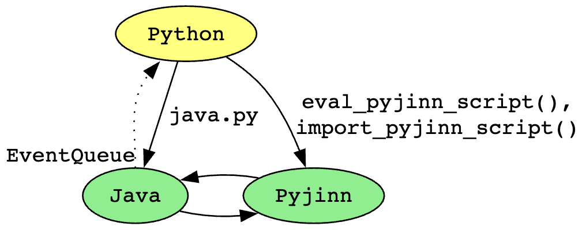

## Pyjinn

### Contents

- [What is Pyjinn?](#what-is-pyjinn)
- [Pyjinn in Minescript 5.0](#pyjinn-in-minescript-50)
  - [When to use Pyjinn](#when-to-use-pyjinn)
  - [Embedding Pyjinn in Python scripts](#embedding-pyjinn-in-python-scripts)
- [Java Integration](#java-integration)
- [Python Language Features](#python-language-features)
- [Python 3.x feature support](#python-3x-feature-support)

### What is Pyjinn?

**Pyjinn** (pronounced like "pidgeon") is a scripting language with Python syntax
that integrates deeply with Java programs. It’s a "pidgin" language that looks
and feels like Python while its implementation and runtime behavior are based in
Java. (The name "Pyjinn" is a portmanteau of "Python" and "jinn", which is
another word for "genie".)

While Pyjinn does not support the Python standard library, Pyjinn scripts can
access the Java standard library and any publicly accessible Java classes loaded
into the Java program in which it's embedded.


### Pyjinn in Minescript 5.0

Pyjinn is integrated into the upcoming release of Minescript 5.0.  This allows
Python-syntax scripts to be executed directly by the Minescript mod within
Minecraft's Java process without requiring a separate Python installation.
Externally executed Python scripts continue to be supported. Minescript Python
scripts and Minescript Pyjinn scripts share the same
[script APIs](https://minescript.net/docs/#minescript-module), with the
exception of event handlers. Minescript Python scripts manage their own
event queue using [EventQueue](https://minescript.net/docs/#eventqueue), whereas
Minescript Pyjinn scripts use single-threaded event handling inspired by
JavaScript:

- `add_event_listener(event_type: str, callback: Callable[..., None], **args) -> int`
- `set_interval(callback: Callable[..., None], timer_millis: int, *args, **kwargs) -> int`
- `set_timeout(callback: Callable[..., None], timer_millis: int, *args, **kwargs) -> int`
- `remove_event_listener(listener_id: int) -> bool`

The supported event types are:

- "tick", "render", "key", "mouse", "chat", "outgoing_chat_intercept", "add_entity",
  "block_update", "explosion", "take_item", "damage", "chunk", "world"

Scripts can import the Minescript standard library explicitly. For simple IDE integration (e.g.
VSCode), you can use imports like these:

- `from system.pyj.minescript import *`
- `import system.pyj.minescript as m`

For consistency with existing Python scripts you can use imports like these:

- `from minescript import *`
- `import minescript`
- `import minescript as m`

If there are no imports of `minescript` or `system.pyj.minescript` in the main
script, it is imported implicitly as:

- `from system.pyj.minescript import *`

For IDE compatibility, `.pyj` files are used only for the main script file and
not imported from other scripts. This is because IDEs like VSCode do not
recognize imports of `.pyj` files. To enable Python-syntax support (syntax
highlighting, autocompletion, etc), add this line to the top of your `.pyj`
file:

- `#!python`

Pyjinn's search path for imports (the equivalent of `PYTHONPATH`, but currently hardcoded) is:

- `minecraft/minescript`
- `minecraft/minescript/system/pyj`

Pyjinn libraries in your `minecraft/minescript` directory can be imported by dropping their `.py`
filename extension.  E.g. `minecraft/minescript/my_kewl_library.py` can be imported into a Pyjinn
script as:

```
import my_kewl_library
```

Pyjinn scripts (`.pyj`) and Python scripts (`.py`) can import the same `.py`
library if that library is compatible with both Python and Pyjinn.

Imported `.py` libraries can detect if they're running in a Pyjinn context by checking whether
`sys.version` contains the string `"Pyjinn"`.  E.g. to disallow Python scripts from importing a
Pyjinn-only `.py` library, you can add code like this at the top of your library:

```
import sys

if "Pyjinn" not in sys.version:
  raise ImportError(f"Module '{__name__}' requires a Pyjinn interpreter.")
```


#### When to use Pyjinn

Pyjinn is best used in these scenarios:

- Developing scripts that can run on systems that don't have a Python installation.
- Scripts that need to start quickly and don't use Python standard libraries or third-party
  Python libraries. (Pyjinn scripts launch faster than Python scripts because Pyjinn scripts run
  inside the game's Java process rather than spawning a subprocess.)
- Scripts that require synchronization with game events, such as scripted game rendering which needs
  to execute arbitrarily complex user-defined script code while blocking the game's render thread.

Python scripts can call into Java code (Minecraft code and any currently loaded mod code, including
Minescript Java code; see [`java.py` module](README.md#java-module)) and Pyjinn code (see
[`eval_pyjinn_script()`](README.md#eval_pyjinn_script) and
[`import_pyjinn_script()`](README.md#import_pyjinn_script)).

Java and Pyjinn can make synchronous calls into each other. This means that each can make a
function or method call into the other and get a return value on the same Java thread, allowing
Pyjinn scripts to register callbacks that are invoked during game ticks and game rendering.

Java and Pyjinn cannot call synchronously into Python code; to do so would be make the game stutter
at best, and unresponsive at worst. While Java code can send events asynchronously via an
[`EventQueue`](README.md#eventqueue) to Python, the Python code is not synchronized to the game tick
or rendered frame in Java that triggered the event. For example, a Python script that registers for
a game event may get called during a later tick than the one that triggered the event.

The following diagram summarizes callability across Python, Pyjinn, and Java. The yellow oval
represents a Python script process, green ovals represent code running in the game's Java process,
solid arrows indicate a synchronous function or method call, and dotted arrow indicates an
asynchronous call:




#### Embedding Pyjinn in Python scripts

Minescript's pre-installed `java` library for Python (`minescript/system/lib/java.py`) supports
embedding Pyjinn scripts within Python scripts to access their global variables and functions.

For example, the Python script below uses `java.eval_pyjinn_script(...)` to embed a Pyjinn script
that defines:

- global variable `x`
- global function `print_x()` that prints the value of `x`
- global function `get_fps(units: str)` that returns the current frames per second with the given units

_**Note:**_ The script below accesses Java code (`net.minecraft.client.Minecraft`) which may be
using name mappings. For details see: [Mappings](mappings.md). **tl;dr:** If you're using the Fabric
mod, install the mappings by running `\install_mappings` before running the script below.

```
# pyjinn_in_python_example.py

import java
# or: import system.lib.java as java

script = java.eval_pyjinn_script(r"""
x = 42
def print_x():
  print(f"x from Pyjinn = {x}")

Minecraft = JavaClass("net.minecraft.client.Minecraft")

def get_fps(units: str) -> str:
  return f"{Minecraft.getInstance().getFps()} {units}"
""")

get_fps = script.get("get_fps")
print("fps:", get_fps("frames per second"))

print(f"x from Python = {script.get('x')}")

print_x = script.get("print_x")
print_x()
script.set("x", 99)
print_x()
```

Chat output:

```
fps: 101 frames per second
x from Python = 42
x from Pyjinn = 42
x from Pyjinn = 99
```

The Python script accesses globals from the Pyjinn script:

- gets a Pyjinn global using `script.get(variable_name: str)`
- sets a Pyjinn global using `script.set(variable_name: str, value: Any)`

Supported types of Pyjinn globals accessible from Python include: `bool`, `float`, `int`, `str`,
`dict`, `list`, Java classes and objects, Java arrays, and user-defined Pyjinn classes and objects.


### Java Integration


#### JavaClass

Import Java classes with `JavaClass()` which takes a string literal:

```
List = JavaClass("java.util.List")
```

`JavaClass` is Pyjinn's wrapper around a Java `Class<?>` and provides access to the class's
constructors using function-call syntax and static methods using method-call syntax. This is
different from `Class<?>` instances which are metaclasses that provide access to reflection
information. Calling `type()` on a `JavaClass` returns the Java metaclass (e.g. `String.class`).

```
print(JavaClass("java.lang.String"))
# prints: JavaClass("java.lang.String")

print(type("This is a string"))
# prints: JavaClass("java.lang.String")

print("This is a string".getClass())
# prints Class<String>: class java.lang.String

print(type(42))
# prints: JavaClass("java.lang.Integer")

print(type(42).MAX_VALUE)
# prints equivalent of `Integer.MAX_VALUE`: 2147483647

print(type(42)(99))
# prints equivalent of `new Integer(99)`: 99

print(type(Integer))
# prints the metaclass Integer.class: class java.lang.Integer

print(Integer.TYPE)
# prints the int.class primitive type: int
```

#### Calling static and non-static Java methods

Call static method of Java class:
```
List = JavaClass("java.util.List")
java_list = List.of(1, 2, 3)
```

Call non-static method of Java object:
```
print(java_list.size())

# Also available in Python-compatible form: len(java_list)
```

#### JavaList

Get Java List from Pyjinn list (does **not** make a copy of the list or its elements):
```
java_list = JavaList([1, 2, 3])
```

#### JavaArray

Get Java array (`Object[]`) from Pyjinn tuple:
```
my_tuple = (1, 2, 3, "foo", "bar")
java_array = JavaArray(my_tuple)
print(len(java_array))  # Equivalent to the java code: java_array.length
```

Java arrays and iterables are automatically treated as Pyjinn sequences and support slice notation:
```
int_tuple = (1, 2, 3)
java_array = JavaArray(int_tuple)  # type of java_array is Object[]
for x in java_array:
  print(x)

# Applies Python slice syntax to a Java array and returns a
# new Java array of the same type:
print(java_array[-2:])
```

Convert tuple to a Java array of a specific type, e.g. `int[]`, by passing a type as the second
argument:
```
Integer = JavaClass("java.lang.Integer")

# Equivalent to this Java code:
# int[] java_int_array = new int[] { 1, 2, 3 };
java_int_array = JavaArray((1, 2, 3), Integer.TYPE)

print(type(java_int_array))  # prints: JavaClass("[I")
```

When converting a Pyjinn tuple to a Java array of a specific type, all elements of the tuple need to
be assignable to the requested array type.

#### Implementing Java interfaces in Pyjinn

Pyjinn functions passed to methods with a parameter type that's a Java interface are automatically
converted to implementations of that interface. In this example, `Stream::map` is a Java method that
takes a `Function<>` and `Stream::filter` takes a `Predicate<>`. Here, Pyjinn `lambda` expressions
are passed to those Java methods to square the input number and filter for the resulting values that
are even numbers:
```
java_list = JavaList([x for x in range(10)])
print(
    java_list.stream()
        .map(lambda x: x * x)
        .filter(lambda x: x % 2 == 0)
        .toList())
# prints: [0, 4, 16, 36, 64]
```

Pyjinn functions can also be converted manually to a Java interface by calling the Java interface as
if it's a Python constructor:
```
Runnable = JavaClass("java.lang.Runnable")
x = Runnable(lambda: print("hello!"))
x.run()  # prints: hello!
```

#### Strings

String objects in Pyjinn (e.g. `"this is a test"`) are instances of `java.lang.String`. Some
Python-compatible methods can be called on Pyjinn strings (see [Python 3.x feature support:
str](#str)), as well as the ~50 methods available to `java.lang.String`.

Pyjinn strings support Python slice operations:
```
s = "foobarbaz"
print(s[0])  # prints: f
print(s[-1])  # prints: z
print(s[3:])  # prints: barbaz
print(s[3:6])  # prints: bar
```

Although `String` is a `final` class in Java that cannot be subclassed, Pyjinn strings act as though
they're a subclass of `String`, extended with some Python-specific methods. (They're not actually a
subclass of `String`, there's just logic built into the interpreter to allow additional methods to
be called on `String` objects in Pyjinn scripts.)
```
# Python-compatible call to str.startswith():
print("foo".startswith("o", 1))  # prints: True

# Java call to String.startsWith() (note the different capitalization):
print("foo".startsWith("f"))  # prints: True
```

Some string methods like `split()` have the same name across Python and Java but with different
behavior.  For Pyjinn string methods that have Python-compatible behavior and there's a Java
`String` method with the same name, Pyjinn strings by default behave like they do in Python. In rare
cases where a script needs to access Java `String` functionality that conflicts with the
Python-compatible `str` behavior, the Java behavior can be accessed by wrapping the string in
`JavaString()`:
```
s = "this is a test"

# Call Python-compatible str.split():
print(s.split())  # prints: ["this", "is", "a", "test"]

# Call Java String.split() which takes a regular expression:
print(JavaString(s).split(r'\s+'))  # prints: ["this", "is", "a", "test"]
```

Although the return value of `JavaString(...)` gives access to all the Java methods of
`java.lang.String` (without any of the Python-compatible methods), its runtime type is
`org.pyjinn.interpreter.JavaString`.

Both Pyjinn strings and `JavaString` objects can be passed without any explicit conversion to Java
methods that expect `java.lang.String`. In the rare case that a `JavaString` needs to be converted
explicitly back to `String`, a script can call its `toString()` method:
```
s = "foo"
print(s is JavaString(s).toString())  # prints: True
```

`JavaString` is an advanced usage that should not be necessary in most scripts.


### Python Language Features

The following are the Python language features supported in Pyjinn.

Names in `UPPER_CASE_WITH_UNDERSCORES` are example names.

`...` refers to omitted code.

**Python expressions:**

```
# Constant expressions:
None  # NoneType
True  # bool
False # bool
123   # int
3.14  # float
"hi"  # str
'bye' # str
r'\o/' # str (raw literal)
"""triple quoted"""
'''triple quoted'''

# Formatted strings (f-string):
X = 1
Y = 2
print(f"{X} + {Y} = {X+Y}")  # prints: 1 + 2 = 3

# Tuple literal:
(X, Y, Z)

# Tuple assignment:
X, Y = 1, 2
X, Y = (1, 2)
X, Y = [1, 2]

# List literal:
[X, Y, Z]

# Dict literal:
{K1: V1, K2: V2, ...}

# Binary operators:
X is Y
X is not Y
X == Y
X < Y
X <= Y
X > Y
X >= Y
X != Y
X in Y
X not in Y

# Call function with an iterable sequence into distinct args:
FUNC(*[1, 2, 3])  # call as FUNC(1, 2, 3)

# Convert dict with str keys into keyword arguments to a function:
# (since Pyjinn 0.9)
FUNC(**{"K1": V1, "K2": V2, ...}) 
# equivalent to: FUNC(K1=V1, K2=V2, ...)

# Capture keyword args passed to a function as a dict:
# (since Pyjinn 0.9)
def FUNC(**kwargs):
  ...

# Operators:
-X  # for numeric types
X and Y
X or Y
not X
X + Y
X - Y
X * Y
X / Y
X // Y  # since Pyjinn 0.9
X ** Y
X % Y
X << Y  # since Pyjinn 0.6
X >> Y  # since Pyjinn 0.6

# Built-in functions:
abs(X)
bool(X)
chr(INT)
dict:
  dict()
  dict(DICT_TO_COPY)
  dict(ITERABLE_OF_PAIRS)  # e.g. dict([(K1, V1), (K2, V2)])
  dict(K1=V1, K2=V2, ...)
enumerate(ITERABLE)
float(X)
globals()
hex(X)
int(X)
len(ITERABLE)
list:
  list()
  list(ITERABLE)
max(X, Y, ...)
min(X, Y, ...)
ord(STR)
print(...)
range(...)
round(X)
str(X)
tuple(ITERABLE)
type(X)

# Index/Slice operations:
X[INDEX]
X[FROM:]
X[:TO]
X[:]
X[FROM:TO:STEP]
X[:-1]  # Negative indices are relative to the end of the sequence.

# if-else expression:
TRUE_VALUE if CONDITION else FALSE_VALUE

# List comprehension:
[X * 2 for X in range(5)]  # evaluates to: [0, 2, 4, 6, 8]
[C for C in "hello"]  # evaluates to: ["h", "e", "l", "l", "o"]

# Lambda expression:
lambda: print("no args")
lambda X: print("1 arg:", X)
lambda X, Y: print("2 args:", X, Y)
```


**Python statements:**

```
# Imports:
import MODULE
import MODULE as ALIAS
from MODULE import NAME1 as ALIAS1, NAME2 as ALIAS2, ...
from MODULE import *

# Assignment:
VAR = VALUE
VAR += VALUE
VAR -= VALUE
VAR *= VALUE
VAR /= VALUE

# Deletion:
del OBJECT
del DICT[KEY]
del LIST[INDEX]

# Print to stdout:
print("SOME STRING")

# Print to stderr:
print("SOME STRING", file=sys.stderr)

# Function definitions:
def FUNCTION_NAME(ARG1, ...):
  ...
  return VALUE

def FUNCTION_NAME(ARG1, *VAR_ARG):
  ...

def FUNCTION_NAME(ARG1, KEYWORD1=VALUE1, KEYWORD2=VALUE2):
  ...

# Class definitions:
class CLASS_NAME:
  def __init__(self, ...):
    self.X = VALUE
    self.Y = VALUE
    ...

  @classmethod
  def METHOD(CLASS, ...):
    ...

  @staticmethod
  def METHOD(...):
    ...

# Construct instance of a class:
OBJECT = CLASS_NAME(...)

# Reference field of object:
print(OBJECT.X)

# Mutable dataclass:
@dataclass
class CLASS_NAME:
  FIELD1: TYPE
  FIELD2: TYPE = DEFAULT_VALUE
  ...

# Immutable dataclass:
@dataclass(frozen=True)
class CLASS_NAME:
  ...

if CONDITION:
  ...
elif CONDITION:
  ...
else:
  ...

for VAR in ITERABLE:
  ...
  break
  ...
  continue  # since Pyjinn 0.5

while CONDITION:
  ...
  break
  ...
  continue  # since Pyjinn 0.5

try:
  ...
except EXCEPTION as NAME:
  ...
except:
  pass

raise EXCEPTION(...)

def FUNCTION_NAME(...):
  global GLOBAL_VAR
  VAR = ...
  def INNER_FUNCTION(...):
    nonlocal VAR
    ...
```

### Python 3.x feature support

This section is current through Minescript 5.0b4 and Pyjinn 0.8.

#### Langauage features

Language features currently **NOT** supported by Pyjinn:

- Python standard library (except for some basics in `sys` module: `sys.argv`,
  `sys.version`, `sys.stdout`, `sys.stderr`)
- `else` blocks following `for` and `while` blocks
- generators and `yield` statement
- threading, asyncio, and async/await syntax (Java `Thread` is supported instead)
- inheritance
- `with` statement
- `match` statement (Python 3.10+)
- keyword-only arguments to functions ([PEP 3102](https://peps.python.org/pep-3102/))
- f-string assignment expressions, e.g. `f"{x = }"` (just prints x's value, not `"x = "`)
- step increments in slice expressions (parses ok, but step values that aren't equivalent to 1 result in an exception)
- special class methods with double underscores (except for `__init__()` which is
  supported)
- arbitrary-precision integers (only fixed-size integers like Java `Integer` and `Long`
  are supported)
- user-defined decorators
- Python-style metaclasses

#### str

- `class str` (runtime type is `java.lang.String`)
  - `endswith(prefix: str, start: int = None, end: int = None) -> bool`
  - `find(sub: str, start: int = None, end: int = None) -> int`
  - `join(iterable) -> str`
  - `lower() -> str`
  - `lstrip(chars: str = None) -> str`
  - `replace(old: str, new: str, count: int = -1) -> str`
  - `rstrip(chars: str = None) -> str`
  - `split(sep: str = None, maxsplit: int = -1)`
  - `startswith(prefix: str, start: int = None, end: int = None) -> bool`
  - `strip(chars: str = None) -> str`
  - `upper() -> str`
  - plus ~50 methods from `java.lang.String` (see [Java Integration: Strings](#strings))

#### tuple

- `class tuple` (runtime type is `org.pyjinn.interpreter.Script.PyTuple`)
  - `__add__(value) -> tuple`
  - `__contains__(key) -> bool`
  - `__eq__(value) -> bool`
  - `__ne__(value) -> bool`
  - `__len__() -> int`
  - `__getitem__(key)`
  - `count(value) -> int`
  - `index(value) -> int`

#### list

- `class list` (runtime type is `org.pyjinn.interpreter.Script.PyList`)
  - `__add__(value) -> list`
  - `__contains__(key) -> bool`
  - `__delitem__(key)`
  - `__eq__(value) -> bool`
  - `__ne__(value) -> bool`
  - `__iadd__(value)`
  - `__len__() -> int`
  - `__getitem__(key)`
  - `__setitem__(key, value)`
  - `append(object)`
  - `clear()`
  - `copy() -> list`
  - `count(value) -> int`
  - `extend(iterable)`
  - `index(value) -> int`
  - `insert(index: int, object)`
  - `pop()`
  - `pop(index: int)`
  - `remove(value)`
  - `reverse()`
  - `sort()`

#### dict

- `class dict` (runtime type is `org.pyjinn.interpreter.Script.PyDict`)
  - `items() -> iterable`
  - `keys() -> iterable`
  - `values() -> iterable`
  - `__len__() -> int`
  - `get(key)`
  - `get(key, default_value)`
  - `setdefault(key)`
  - `setdefault(key, default_value)`
  - `__getitem__(key)`
  - `__setitem__(key, value)`
  - `__contains__(key) -> bool`
  - `__delitem__(key)`


#### Built-in functions

Status of built-in function support in Pyjinn:

- `abs()` - yes
- `aiter()` - no
- `all()` - no
- `anext()` - no
- `any()` - no
- `ascii()` - no
- `bin()` - no
- `bool()` - yes
- `breakpoint()` - no
- `bytearray()` - no
- `bytes()` - no
- `callable()` - no
- `chr()` - yes
- `classmethod()` - yes
- `compile()` - no
- `complex()` - no
- `delattr()` - no
- `dict()` - yes
- `dir()` - no
- `divmod()` - no
- `enumerate()` - yes
- `eval()` - no
- `exec()` - no
- `filter()` - no
- `float()` - yes
- `format()` - no
- `frozenset()` - no
- `getattr()` - no
- `globals()` - yes
- `hasattr()` - no
- `hash()` - no
- `help()` - no
- `hex()` - yes
- `id()` - no
- `input()` - no
- `int()` - yes
- `isinstance()` - no
- `issubclass()` - no
- `iter()` - no
- `len()` - yes (supported for both Python-compatible types and Java iterable types)
- `list()` - yes
- `locals()` - no
- `map()` - no
- `max()` - yes
- `memoryview()` - no
- `min()` - yes
- `next()` - no
- `object()` - no
- `oct()` - no
- `open()` - no
- `ord()` - yes
- `pow()` - no
- `print()` - yes
- `property()` - no
- `range()` - yes
- `repr()` - no
- `reversed()` - no
- `round()` - yes
- `set()` - no
- `setattr()` - no
- `slice()` - no
- `sorted()` - no
- `staticmethod()` - yes
- `str()` - yes
- `sum()` - yes
- `super()` - no
- `tuple()` - yes
- `type()` - yes
- `vars()` - no
- `zip()` - no
- `__import__()` - no

